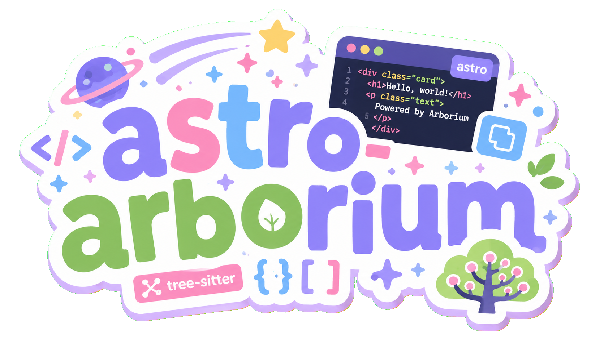

<p align="center">
  
</p>

# astro-arborium

An Astro integration for [Arborium](https://github.com/bearcove/arborium) syntax highlighting.

astro-arborium highlights code in Markdown, MDX, and anywhere else you render code blocks in Astro. Each highlighted block gets a code frame, a language label, and a copy button.

Requires Astro 7.

## Install

```sh
pnpm add @infiniteunion/astro-arborium
```

`@infiniteunion/astro-arborium` bundles the default languages. If you enable any other language, install its grammar package separately:

```sh
pnpm add @arborium/python @arborium/go @arborium/json
```

## Features

The integration performs the following tasks:

- Highlights fenced code blocks with the WebAssembly-backed tree-sitter grammars from Arborium.
- Wraps each block in a code frame with a language label and a copy button.
- Injects the theme CSS.
- Loads the copy-button client script.

For code that does not flow through Markdown—for example, raw `<pre><code>` blocks in `.astro` components, custom HTML, or CMS content—you can use the building blocks individually. See [Standalone usage](#standalone-usage) and [Direct usage](#direct-usage).

## Usage as an Astro integration

For Markdown and MDX, add the integration and disable Astro's built-in syntax highlighting.

```js
// astro.config.mjs
import { defineConfig } from "astro/config"
import arborium from "@infiniteunion/astro-arborium"

export default defineConfig({
  markdown: {
    syntaxHighlight: false,
  },
  integrations: [arborium()],
})
```

The integration highlights fenced code blocks in `.md` and `.mdx` files automatically. MDX works the same way because MDX content flows through Astro's Markdown processor.

## Standalone usage

If you render code through your own unified or rehype pipeline—for example, a custom MDX configuration or a hand-built processor—use the rehype plugins directly from the `@infiniteunion/astro-arborium/rehype` subpath:

```js
import { unified } from "unified"
import remarkParse from "remark-parse"
import remarkRehype from "remark-rehype"
import { rehypeHighlight, rehypeCodeFrame } from "@infiniteunion/astro-arborium/rehype"

const processor = unified()
  .use(remarkParse)
  .use(remarkRehype)
  .use(rehypeHighlight, { languages: ["rust", "typescript"] })
  .use(rehypeCodeFrame)
```

You can also use `rehypeHighlight` and `rehypeCodeFrame` individually: highlight without the frame, or frame pre-highlighted markup. The default export, `rehypeArborium`, runs both in sequence.

> [!NOTE]
> Outside the Astro integration, the copy-button script and the theme CSS are not injected for you. Add them in a layout: import the CSS, and include the client script in a `<script>` tag so it runs in the browser.
>
> ```astro
> ---
> import "@infiniteunion/astro-arborium/style.css" // default One Dark theme
> ---
> <script>
>   import "@infiniteunion/astro-arborium/client" // copy-button behavior
> </script>
> ```

## Direct usage

For code blocks that you write directly inside `.astro` components, use the `<Code>` component. Code blocks in components do not enter the rehype pipeline.

```astro
---
import Code from "@infiniteunion/astro-arborium/components"
import "@infiniteunion/astro-arborium/style.css" // theme CSS (or use the integration / your own)
---

<Code language="typescript" src={`const answer: number = 42`} />
```

The component highlights the source and renders the same code frame, language label, and copy button as Markdown code blocks. It bundles the copy-button client script, so you only need to provide the CSS—via the integration, the `@infiniteunion/astro-arborium/style.css` file (default One Dark theme), or your own Arborium theme CSS.

For lower-level control—for example, emitting highlighted HTML into your own markup—call `highlightCode()` directly:

```astro
---
import { highlightCode } from "@infiniteunion/astro-arborium"

const html = await highlightCode("rust", "fn main() {}")
---
<pre><code set:html={html} /></pre>
```

`highlightCode()` returns an HTML string of highlighted spans only—no frame, copy button, or CSS. Use the `<Code>` component when you want the full code frame, or `createCodeFrame()` from the `@infiniteunion/astro-arborium/rehype` subpath to build the frame markup yourself. The copy-button script targets the `[data-code-copy]` selector, so if you build the frame yourself, add `import "@infiniteunion/astro-arborium/client"` in a `<script>` tag.

> [!CAUTION]
> The `<Code>` component and `highlightCode()` run Arborium at render time, so `@arborium/arborium` must be resolvable from your project. Because pnpm keeps dependencies in an isolated `node_modules` layout and does not hoist transitive dependencies, you'll need to install `@arborium/arborium` as a direct dependency:
>
> ```sh
> pnpm add @arborium/arborium
> ```
>
> Without a direct dependency, highlighting falls back to plain text and the build log shows a `[arborium] Failed to load host` warning. The rehype plugins are not affected because they resolve from the `@infiniteunion/astro-arborium` package itself.

## Configuration

Pass a `languages` array to control which code blocks are highlighted. The default is the original seven languages.

```js
import arborium, { ALL_LANGUAGES } from "@infiniteunion/astro-arborium"

// Highlight every language Arborium supports.
const languages = ALL_LANGUAGES

// Or replace the line above with a custom subset:
// const languages = ["rust", "typescript"]

export default defineConfig({
  markdown: { syntaxHighlight: false },
  integrations: [arborium({ languages })],
})
```

Language identifiers match the Arborium package names (for example, `c-sharp`, `cpp`, and `typescript`).

## Themes

Pass a `theme` option to select one of the themes bundled with Arborium. The default is `"one-dark"`.

```js
import arborium from "@infiniteunion/astro-arborium"

// Use different themes for light and dark mode.
const theme = { light: "github-light", dark: "one-dark" }

// Or replace the line above with a single theme, or no bundled theme styles:
// const theme = "tokyo-night"
// const theme = false

export default defineConfig({
  markdown: { syntaxHighlight: false },
  integrations: [arborium({ theme })],
})
```

`THEMES` exports all 33 bundled theme names.

When `theme: false`, no styles are bundled automatically. You can still import the `@infiniteunion/astro-arborium/style.css` file for the original One Dark look, or provide your own Arborium theme CSS.

## Supported languages

All 113 Arborium grammars are supported. For the complete list, see [`ALL_LANGUAGES`](./src/rehype.ts). Install the matching `@arborium/<lang>` package for any language you enable.

The default languages are:

- Bash
- C++
- Java
- Markdown
- Rust
- TypeScript
- YAML

## Exports

The package exposes the following subpaths:

| Subpath | Description |
| --- | --- |
| `@infiniteunion/astro-arborium` | Astro integration (default export) and helpers (`highlightCode`, configuration) |
| `@infiniteunion/astro-arborium/rehype` | `rehypeHighlight`, `rehypeCodeFrame`, `rehypeArborium`, and `createCodeFrame` |
| `@infiniteunion/astro-arborium/highlight` | `highlightCode`, `arboriumConfig`, and `createArboriumConfig` |
| `@infiniteunion/astro-arborium/labels` | `getLanguageLabel` and `LANGUAGE_LABELS` |
| `@infiniteunion/astro-arborium/components` | The `<Code>` Astro component |
| `@infiniteunion/astro-arborium/client` | Copy-button client script (imported automatically by the integration) |
| `@infiniteunion/astro-arborium/style.css` | Default One Dark theme CSS |

## Example

For a demo landing page, see the `website/` directory in this repository.

## License

Licensed under either of:

- Apache License, Version 2.0 ([LICENSE-APACHE](LICENSE-APACHE) or http://www.apache.org/licenses/LICENSE-2.0)
- MIT License ([LICENSE-MIT](LICENSE-MIT) or http://opensource.org/licenses/MIT)

at your option.
